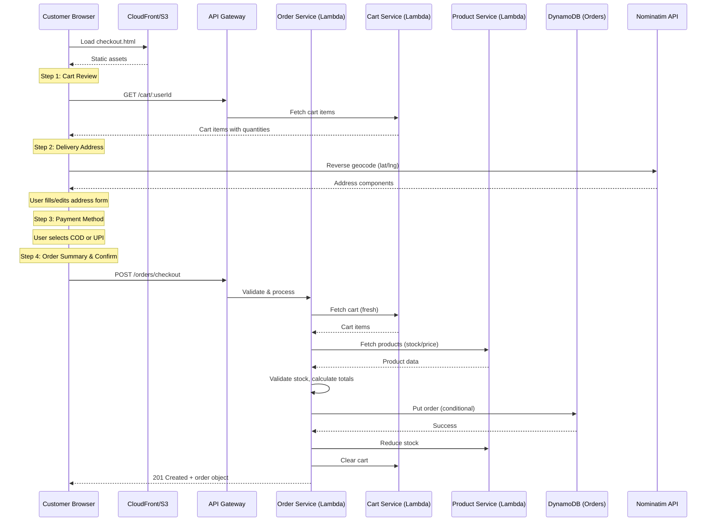
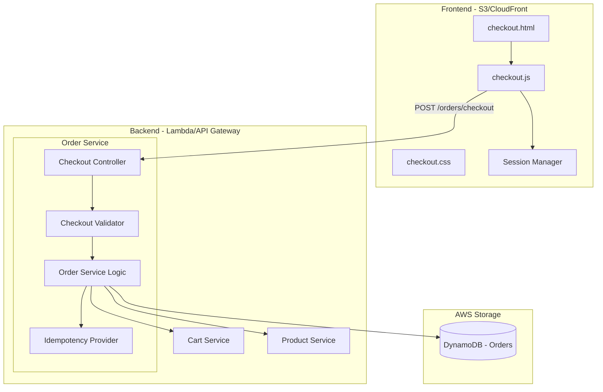

# Design Document: Enhanced Checkout

## Overview

The Enhanced Checkout feature replaces NexMart's current single-click "Place Order Now" flow with a multi-step wizard: Cart Review → Delivery Address → Payment Method → Order Summary/Confirmation. This design introduces frontend state management for step navigation, backend validation for delivery and payment data, geolocation-based address auto-fill, duplicate submission prevention, and session state preservation.

The solution extends the existing order-service (Controller/Service pattern) with a new `POST /orders/checkout` endpoint that accepts delivery address and payment details alongside the existing cart-fetching logic. The frontend adds a `checkout.html` page with a step-by-step wizard component, and the DynamoDB orders table schema is extended to store delivery and payment information.

### Key Design Decisions

1. **Single checkout endpoint**: Rather than multiple API calls per step, the frontend collects all data locally and submits once at confirmation. This reduces network overhead and simplifies error handling.
2. **Client-side step state with sessionStorage**: Checkout state (address, payment, current step) is persisted in `sessionStorage` for within-session preservation and survives page refreshes for up to 30 minutes.
3. **Backend-as-source-of-truth for cart**: Cart items are always fetched fresh from Cart_Service at submission time to ensure current stock/prices.
4. **Idempotency via conditional writes**: Duplicate order prevention uses DynamoDB conditional expressions with a client-generated idempotency key.
5. **Reverse geocoding via free API**: Uses the Nominatim OpenStreetMap API for reverse geocoding to avoid paid service dependencies.

## Architecture



### Component Architecture



## Components and Interfaces

### Frontend Components

#### CheckoutWizard (checkout.js)

The main orchestrator for the multi-step checkout flow.

| Method | Description |
|--------|-------------|
| `initCheckout()` | Loads cart data, restores session state, renders step 1 |
| `navigateToStep(stepNumber)` | Validates current step, transitions to target step |
| `validateCurrentStep()` | Runs validation rules for the active step |
| `renderStep(stepNumber)` | Shows/hides step panels, updates progress indicator |
| `submitOrder()` | Collects all data, sends POST /orders/checkout |
| `preserveState()` | Saves current form data to sessionStorage |
| `restoreState()` | Loads previously saved form data from sessionStorage |

#### AddressAutoFill (checkout.js)

Handles geolocation and reverse geocoding.

| Method | Description |
|--------|-------------|
| `detectLocation()` | Requests browser Geolocation API with 10s timeout |
| `reverseGeocode(lat, lng)` | Calls Nominatim API to resolve coordinates to address |
| `populateAddressFields(address)` | Fills form fields with resolved address data |

#### SessionManager (checkout.js)

Manages checkout state persistence.

| Method | Description |
|--------|-------------|
| `save(state)` | Serializes checkout state to sessionStorage with timestamp |
| `load()` | Restores state if within 30-minute window |
| `clear()` | Removes stored checkout state |
| `isExpired()` | Returns true if saved state is older than 30 minutes |

### Backend Components

#### Checkout Controller (`checkoutController.js`)

New controller in order-service handling the checkout endpoint.

```javascript
// POST /orders/checkout
async function checkoutHandler(req, res) {
  // 1. Extract and validate request body
  // 2. Check idempotency key
  // 3. Fetch cart from Cart Service
  // 4. Fetch products and validate stock
  // 5. Calculate totals
  // 6. Create order with delivery + payment data
  // 7. Reduce stock
  // 8. Clear cart
  // 9. Return created order
}
```

#### Checkout Validator (`checkoutValidator.js`)

Express-validator middleware chain for the checkout endpoint.

| Validation Rule | Field | Constraint |
|----------------|-------|------------|
| Required, non-empty | userId | Non-whitespace string |
| Required object | deliveryAddress | Object with required fields |
| String length | deliveryAddress.street | 1–200 characters |
| String length | deliveryAddress.city | 1–100 characters |
| String length | deliveryAddress.state | 1–100 characters |
| Regex match | deliveryAddress.pincode | Exactly 6 digits (`/^\d{6}$/`) |
| Optional string | deliveryAddress.landmark | 0–200 characters |
| Enum | paymentMethod | "COD" or "UPI" |
| Conditional required | paymentDetails.upiId | Required when paymentMethod = "UPI" |
| Regex match | paymentDetails.upiId | `/^[a-zA-Z0-9.\-]+@[a-zA-Z0-9]+$/`, 3–50 chars |
| Array size | items (from cart) | 1–50 items |

#### Idempotency Provider (`idempotencyProvider.js`)

Prevents duplicate order submissions within a 30-second window.

| Method | Description |
|--------|-------------|
| `checkAndSet(idempotencyKey, userId)` | Uses DynamoDB conditional put with TTL |
| `getExistingOrder(idempotencyKey)` | Returns previously created order if exists |

### API Interface

#### POST /orders/checkout

**Request:**
```json
{
  "userId": "string",
  "idempotencyKey": "string (UUID, generated client-side)",
  "deliveryAddress": {
    "street": "string (1-200 chars)",
    "city": "string (1-100 chars)",
    "state": "string (1-100 chars)",
    "pincode": "string (exactly 6 digits)",
    "landmark": "string (optional, 0-200 chars)"
  },
  "paymentMethod": "COD | UPI",
  "paymentDetails": {
    "upiId": "string (required if UPI, format: username@provider, 3-50 chars)"
  }
}
```

**Success Response (201):**
```json
{
  "orderId": "uuid-string",
  "userId": "string",
  "items": [...],
  "deliveryAddress": {...},
  "paymentMethod": "COD | UPI",
  "paymentDetails": {...},
  "totalAmount": 1234.56,
  "status": "CREATED",
  "createdAt": "2024-01-15T10:30:00.000Z"
}
```

**Error Responses:**

| Status | Condition |
|--------|-----------|
| 400 | Validation errors (missing fields, invalid format) |
| 400 | Cart is empty |
| 400 | Stock insufficient (includes product name and available qty) |
| 401 | Missing or invalid JWT |
| 409 | Duplicate submission (returns original order) |
| 500 | Stock reduction failed |
| 502 | Cart Service unreachable |

## Data Models

### Order Item (DynamoDB - `asif-order` table)

The existing orders table schema is extended to include delivery and payment fields.

```javascript
{
  orderId: "string (UUID)",           // Partition key
  userId: "string",
  items: [                            // Array, max 50 items
    {
      productId: "string",
      name: "string",
      quantity: "number",
      price: "number",
      lineTotal: "number"
    }
  ],
  deliveryAddress: {                  // NEW
    street: "string (1-200 chars)",
    city: "string (1-100 chars)",
    state: "string (1-100 chars)",
    pincode: "string (6 digits)",
    landmark: "string (optional, 0-200 chars)"
  },
  paymentMethod: "string (COD|UPI)",  // NEW
  paymentDetails: {                   // NEW
    upiId: "string (when UPI)"        // Empty object when COD
  },
  totalAmount: "number (0.01-999999999.99)",
  status: "string (CREATED)",
  createdAt: "string (ISO 8601)",
  idempotencyKey: "string (UUID)"     // NEW - for duplicate detection
}
```

### Idempotency Record (DynamoDB - `asif-order` table, separate item type)

Uses the same orders table with a different key pattern to avoid an extra table.

```javascript
{
  orderId: "IDEMPOTENCY#<idempotencyKey>",  // Partition key (prefixed)
  userId: "string",
  linkedOrderId: "string (actual orderId)",
  createdAt: "string (ISO 8601)",
  ttl: "number (epoch seconds, current + 30)"  // DynamoDB TTL for auto-expiry
}
```

### Checkout Session State (sessionStorage - Frontend)

```javascript
{
  checkoutState: {
    currentStep: 1,                // 1-4
    cartItems: [...],              // Snapshot for display
    deliveryAddress: {
      street: "",
      city: "",
      state: "",
      pincode: "",
      landmark: ""
    },
    paymentMethod: null,           // "COD" | "UPI" | null
    paymentDetails: {
      upiId: ""
    },
    lastUpdated: "ISO 8601 timestamp"
  }
}
```

### Validation Rules Summary

| Field | Frontend Rule | Backend Rule |
|-------|--------------|--------------|
| street | Required, ≤200 chars, non-whitespace | 1-200 chars, non-empty after trim |
| city | Required, ≤100 chars, non-whitespace | 1-100 chars, non-empty after trim |
| state | Required, ≤100 chars, non-whitespace | 1-100 chars, non-empty after trim |
| pincode | Required, exactly 6 digits | Regex `/^\d{6}$/` |
| landmark | Optional, ≤200 chars | 0-200 chars |
| paymentMethod | Required selection | Enum: "COD", "UPI" |
| upiId (if UPI) | Required, format check | Regex `/^[a-zA-Z0-9.\-]+@[a-zA-Z0-9]+$/`, 3-50 chars |
| items count | — (from cart) | 1-50 items |
| totalAmount | — (calculated) | 0.01-999,999,999.99 |


## Correctness Properties

*A property is a characteristic or behavior that should hold true across all valid executions of a system — essentially, a formal statement about what the system should do. Properties serve as the bridge between human-readable specifications and machine-verifiable correctness guarantees.*

### Property 1: Line Total Calculation

*For any* cart item with a positive unit price and positive integer quantity, the computed line total SHALL equal unit price multiplied by quantity.

**Validates: Requirements 1.1**

### Property 2: Cart Total is Sum of Line Totals

*For any* non-empty array of cart items where each item has a valid line total, the cart total amount SHALL equal the sum of all line totals.

**Validates: Requirements 1.3**

### Property 3: Address Validation Correctness

*For any* delivery address object, the validator SHALL reject the address if and only if at least one required field (street, city, state, pincode) contains only whitespace characters or is empty, and the error response SHALL list exactly the set of fields that are invalid.

**Validates: Requirements 2.2, 2.4, 7.1, 7.2**

### Property 4: Pincode Format Validation

*For any* string, the pincode validator SHALL accept it if and only if it consists of exactly 6 digit characters (`/^\d{6}$/`). All other strings SHALL be rejected with a format error.

**Validates: Requirements 2.5, 7.5**

### Property 5: UPI ID Format Validation

*For any* string, the UPI ID validator SHALL accept it if and only if it matches the pattern `username@provider` (alphanumeric characters, dots, or hyphens before @, alphanumeric after @) and is between 3 and 50 characters in total length. All non-matching strings SHALL be rejected.

**Validates: Requirements 4.6, 7.4**

### Property 6: Payment Method Enum Validation

*For any* string value provided as payment method, the validator SHALL accept it if and only if it equals "COD" or "UPI". All other values SHALL be rejected with an invalid payment method error.

**Validates: Requirements 7.3**

### Property 7: Order Creation Invariants

*For any* valid checkout request that is successfully processed, the created order SHALL contain: a UUID-format orderId, all submitted delivery address fields, the selected payment method and details, a status of exactly "CREATED", a createdAt timestamp in ISO 8601 format, and a totalAmount equal to the sum of (quantity × price) for all items.

**Validates: Requirements 6.1, 6.2, 9.2**

### Property 8: Idempotent Order Submission

*For any* valid checkout request submitted twice with the same idempotency key within a 30-second window, the system SHALL return the same order (identical orderId and data) on both submissions and SHALL NOT create a second order record.

**Validates: Requirements 11.5**

## Error Handling

### Frontend Error Handling

| Scenario | Behavior | Recovery |
|----------|----------|----------|
| Cart API fails to load | Display error message, remain on cart page | Retry button |
| Geolocation denied/timeout | Show "Location detection failed" message | Prompt manual entry |
| Reverse geocoding fails | Show "Address could not be determined" | Prompt manual entry |
| Validation errors (any step) | Show field-specific errors, prevent navigation | User corrects fields |
| Order submission timeout (10s) | Display "Service unavailable" | Allow retry up to 3 times |
| HTTP 400 (validation/stock) | Display specific error message from backend | User corrects or adjusts cart |
| HTTP 401 (token expired) | Redirect to login, preserve checkout state | Restore state on re-auth |
| HTTP 409 (duplicate) | Show success with original order (transparent to user) | Navigate to order confirmation |
| HTTP 502 (Cart Service down) | Display "Unable to process order" | Retry button |
| Network failure | Display generic connection error | Retry button |

### Backend Error Handling

| Scenario | HTTP Status | Response Body | Side Effects |
|----------|-------------|---------------|--------------|
| Invalid request body | 400 | `{ error: "Validation failed", fields: [...] }` | None |
| Cart empty | 400 | `{ error: "Cart is empty" }` | None |
| Insufficient stock | 400 | `{ error: "Only X quantity available for ProductName" }` | None |
| Invalid payment method | 400 | `{ error: "Payment method is invalid" }` | None |
| Invalid UPI ID | 400 | `{ error: "Valid UPI ID is required" }` | None |
| Invalid pincode | 400 | `{ error: "Pincode is invalid" }` | None |
| Missing/invalid JWT | 401 | `{ error: "Unauthorized" }` | None |
| Duplicate submission | 409 | Original order object | None (idempotent) |
| Stock reduction failure | 500 | `{ error: "Stock update failed" }` | Order NOT considered placed |
| Cart Service unreachable | 502 | `{ error: "Failed to fetch cart" }` | No order created |
| Cart clear failure (post-order) | — | Order still returned as success | Log error, no rollback |

### Error Propagation Strategy

1. **Fail fast on validation**: All input validation runs before any side effects (cart fetch, stock check, DB writes).
2. **No partial orders**: If stock reduction fails, the order is not returned as successful even if the DB write succeeded. The order record may exist but the response signals failure, allowing the client to retry.
3. **Graceful degradation for non-critical operations**: Cart clearing is best-effort. If it fails, the order is still valid — the cart items will simply still appear until manually removed or cleared on next order.
4. **Idempotent retries**: The idempotency key ensures that retries after timeouts or network errors don't create duplicate orders.

## Testing Strategy

### Unit Tests (Jest)

Unit tests cover specific examples, edge cases, and integration points:

| Test Area | Examples |
|-----------|----------|
| Checkout Validator | Valid request accepted; missing fields return correct error list; boundary values for field lengths |
| Order Service (createOrder) | Order created with correct structure; UUID generated; timestamp format correct |
| Cart Total Calculation | Empty cart = 0; single item; multiple items; floating point precision |
| Stock Validation | Sufficient stock passes; insufficient stock returns product name + available qty |
| Idempotency Check | New key proceeds; duplicate key within 30s returns existing order; expired key allows new order |
| Address Auto-fill | Valid geocode response populates fields; failed response shows error message |
| Session State | State saved and loaded within 30 min; state expired after 30 min; state cleared on success |

### Property-Based Tests (fast-check)

Property-based tests validate universal correctness properties using the `fast-check` library for JavaScript. Each property test runs a minimum of 100 iterations with randomly generated inputs.

| Property | Test Description | Tag |
|----------|------------------|-----|
| Property 1 | Generate random prices (0.01–9999.99) and quantities (1–100), verify lineTotal = price × qty | Feature: enhanced-checkout, Property 1: Line total equals unit price multiplied by quantity |
| Property 2 | Generate arrays of 1–50 items with random lineTotals, verify sum equals cartTotal | Feature: enhanced-checkout, Property 2: Cart total is sum of all line totals |
| Property 3 | Generate random address objects with various whitespace/non-whitespace values, verify validator accepts/rejects correctly and error lists match | Feature: enhanced-checkout, Property 3: Address validation accepts non-whitespace required fields and lists exactly invalid fields |
| Property 4 | Generate random strings (digits, alpha, mixed, various lengths), verify only 6-digit strings accepted | Feature: enhanced-checkout, Property 4: Pincode accepts exactly 6-digit strings |
| Property 5 | Generate random strings with @, dots, hyphens, verify regex match aligns with validator result | Feature: enhanced-checkout, Property 5: UPI ID accepts valid username@provider format |
| Property 6 | Generate random strings, verify only "COD" and "UPI" accepted | Feature: enhanced-checkout, Property 6: Payment method accepts only COD or UPI |
| Property 7 | Generate random valid checkout data, create order, verify output has UUID, status "CREATED", ISO timestamp, correct total | Feature: enhanced-checkout, Property 7: Order creation produces valid structure with correct invariants |
| Property 8 | Generate random valid orders, submit twice with same key, verify same orderId returned both times | Feature: enhanced-checkout, Property 8: Duplicate submission with same idempotency key returns original order |

### Integration Tests (Supertest)

| Test | Description |
|------|-------------|
| POST /orders/checkout happy path | Valid request returns 201 with complete order object |
| POST /orders/checkout no JWT | Returns 401 |
| POST /orders/checkout empty cart | Returns 400 with "Cart is empty" |
| POST /orders/checkout stock insufficient | Returns 400 with product name and available quantity |
| POST /orders/checkout Cart Service down | Returns 502, no order created |
| POST /orders/checkout stock reduction fails | Returns 500 |
| POST /orders/checkout duplicate within 30s | Returns 409 with original order |
| GET /orders/:userId with orders | Returns all orders with delivery/payment fields |
| GET /orders/:userId no orders | Returns empty array |

### Smoke Tests

| Test | Description |
|------|-------------|
| Checkout endpoint reachable | POST /orders/checkout returns non-5xx for valid request |
| JWT authorizer active | Request without token returns 401 |

### Test Configuration

- **Framework**: Jest + Supertest (existing pattern)
- **PBT Library**: `fast-check` (npm package for property-based testing in JS)
- **Minimum PBT iterations**: 100 per property
- **Mocking**: `jest.mock('aws-sdk')` for DynamoDB, `jest.mock('axios')` for inter-service calls
- **Test location**: `order-service/src/tests/checkout.test.js` (unit + property), `order-service/src/tests/checkout.integration.test.js` (integration)
