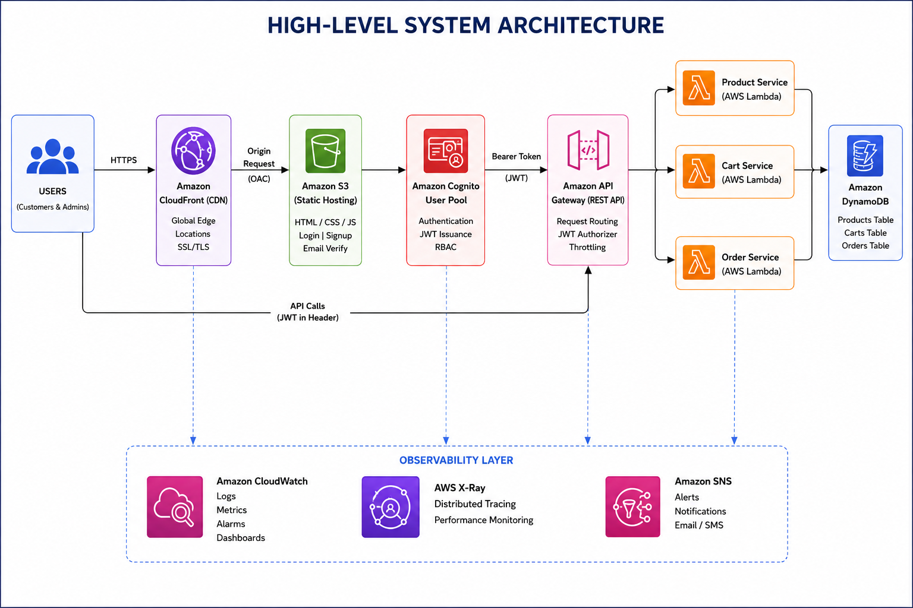
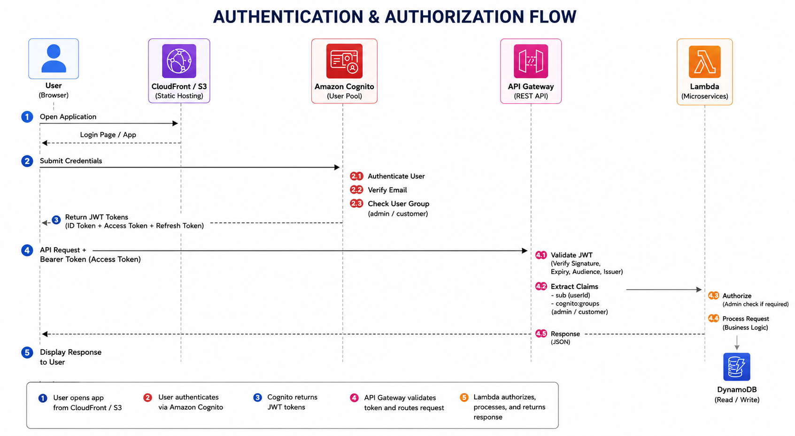
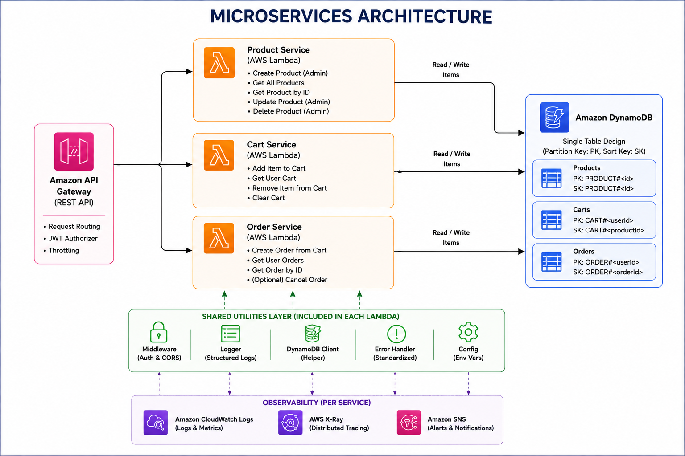

<div align="center">

# 🛒 NexMart

### Cloud-Native Serverless E-Commerce Platform

[](https://aws.amazon.com/)
[](https://www.terraform.io/)
[](https://aws.amazon.com/lambda/)
[](https://aws.amazon.com/dynamodb/)
[](LICENSE)

*A production-grade, fully serverless, microservices-based e-commerce platform built on AWS — designed for scale, security, and observability.*

</div>

---

## 📋 Table of Contents

- [Project Overview](#-project-overview)
- [Business Problem](#-business-problem)
- [Architecture Diagrams](#️-architecture-diagrams)
  - [High-Level Architecture](#high-level-system-architecture)
  - [Authentication Flow](#authentication--authorization-flow)
  - [Service Architecture](#microservices-architecture)
- [AWS Services Used](#-aws-services-used)
- [Features](#-features)
  - [Customer Features](#customer-features)
  - [Admin Features](#admin-features)
- [Security Architecture](#-security-architecture)
  - [Cognito Authentication & Authorization](#cognito-authentication--authorization)
  - [JWT Flow](#jwt-token-flow)
- [API Documentation](#-api-documentation)
- [DynamoDB Design](#️-dynamodb-design)
- [Observability & Monitoring](#-observability--monitoring)
- [Infrastructure as Code](#️-infrastructure-as-code)
  - [Terraform Project Structure](#terraform-project-structure)
  - [Deployment Steps](#deployment-steps)
- [Testing Strategy](#-testing-strategy)
- [Challenges & Learnings](#-challenges--learnings)
- [Future Enhancements](#-future-enhancements)

---

## 🧩 Project Overview

**NexMart** is a cloud-native, fully serverless e-commerce platform architected on AWS using a microservices design pattern. It is not a traditional CRUD application — it is engineered to reflect how real-world production e-commerce systems operate at scale, with a clear separation of concerns, event-driven architecture, and deep observability baked in from day one.

The platform is built around the principle of **zero server management**: there are no EC2 instances to patch, no servers to provision, and no capacity to pre-plan. Every compute, storage, auth, and observability concern is delegated to managed AWS services, assembled and governed entirely through **Terraform Infrastructure as Code**.

| Dimension | Detail |
|---|---|
| **Architecture Style** | Microservices + Serverless |
| **Cloud Provider** | Amazon Web Services (AWS) |
| **Frontend Hosting** | Amazon S3 + CloudFront (CDN) |
| **Auth** | Amazon Cognito (JWT-based, Role-Based Access Control) |
| **Backend** | API Gateway + AWS Lambda |
| **Database** | Amazon DynamoDB (NoSQL) |
| **Observability** | CloudWatch + X-Ray + SNS |
| **IaC** | Terraform (split frontend/backend stacks) |

---

---

## 🌐 Live Demo

### Frontend

https://d8kithip31g8l.cloudfront.net

### Backend

https://o8kqf93jnf.execute-api.ap-southeast-1.amazonaws.com

---

## 💼 Business Problem

Traditional e-commerce backends are commonly deployed as monolithic applications on fixed infrastructure — a design that introduces several operational and scalability challenges:

- **Scaling bottlenecks:** The entire application must be scaled even when only one component (e.g., the cart service) is under load.
- **Single point of failure:** A bug in one module can bring down the entire platform.
- **Operational overhead:** Managing servers, patching OS, handling capacity planning, and maintaining uptime consume significant engineering resources.
- **Slow release cycles:** Tightly coupled services mean a change to the order module requires redeploying the entire application.
- **High idle cost:** Fixed infrastructure runs at full cost 24/7, regardless of actual traffic.

**NexMart solves these problems** by decomposing the platform into independently deployable microservices, each backed by a dedicated AWS Lambda function. Traffic scales automatically, billing is per-invocation, deployments are isolated to individual services, and observability is first-class — not bolted on.

---

## 🏗️ Architecture Diagrams

### High-Level System Architecture

<p align="center">
  
</p>

---

### Authentication & Authorization Flow

<p align="center">
  
</p>

---

### Microservices Architecture

<p align="center">
  
</p>

---

## ☁️ AWS Services Used

| Service | Purpose | Category |
|---|---|---|
| **Amazon S3** | Static frontend hosting (HTML, CSS, JS) | Storage |
| **Amazon CloudFront** | Global CDN with HTTPS, caching, and OAC | Networking |
| **Origin Access Control (OAC)** | Restricts S3 access to CloudFront only | Security |
| **Amazon Cognito User Pool** | User registration, login, JWT issuance | Auth |
| **Cognito App Client** | OAuth 2.0 client configuration | Auth |
| **Amazon API Gateway** | RESTful API routing, auth, throttling | Compute |
| **AWS Lambda** | Serverless compute for each microservice | Compute |
| **Amazon DynamoDB** | NoSQL database for products, carts, orders | Database |
| **Amazon CloudWatch** | Logs, dashboards, alarms, metrics | Observability |
| **Amazon SNS** | Alert notifications via email | Notifications |
| **AWS X-Ray** | Distributed tracing across services | Observability |
| **AWS IAM** | Fine-grained permissions for all services | Security |
| **Terraform** | Infrastructure provisioning and management | IaC |

---

## ✨ Features

### Customer Features

- 🔐 **Secure Authentication** — Register, log in, and verify email via Amazon Cognito
- 🛍️ **Product Browsing** — View the full product catalog with name, description, price, and stock info
- 🛒 **Shopping Cart** — Add, update, and remove items from a persistent cart (scoped per user)
- 📦 **Order Placement** — Checkout and create orders, which are persisted in DynamoDB
- 📋 **Order History** — View all past orders with status tracking
- 🔑 **JWT Session Management** — Token-based auth with automatic refresh handling
- 📱 **Responsive UI** — Frontend delivered over CloudFront for sub-100ms global page loads

### Admin Features

- 🔒 **Role-Based Access** — Admin users are members of the `admin` Cognito group; unauthorized routes return `403 Forbidden`
- ➕ **Product Management** — Create, update, and delete products through admin-protected product endpoints
- 📦 Admin Order Management
  - View all customer orders
  - View customer email addresses
  - Update order status
  - Track order lifecycle
- 📈 **Business Metrics Dashboard** — CloudWatch dashboard showing operational and business metrics in real time

---

## 🔐 Security Architecture

NexMart follows the AWS Well-Architected Framework's Security Pillar across all layers of the stack.

### Layers of Defense

```
┌─────────────────────────────────────────────────────────────────────────────┐
│  Layer 1: Network Edge                                                      │
│  CloudFront OAC — only CloudFront can access S3; direct S3 URLs return 403 │
├─────────────────────────────────────────────────────────────────────────────┤
│  Layer 2: Identity & Access                                                 │
│  Cognito User Pool — enforced email verification, password policy,          │
│  JWT-based sessions, group membership (Admin/Customer)                      │
├─────────────────────────────────────────────────────────────────────────────┤
│  Layer 3: API Authorization                                                 │
│  API Gateway JWT Authorizer — validates token signature and expiry before   │
│  forwarding to Lambda; admin routes check cognito:groups claim              │
├─────────────────────────────────────────────────────────────────────────────┤
│  Layer 4: Compute                                                           │
│  Lambda runs with least-privilege IAM roles (per service, per action)      │
├─────────────────────────────────────────────────────────────────────────────┤
│  Layer 5: Data                                                              │
│  DynamoDB encryption at rest (AWS-managed keys), HTTPS-only data in transit │
└─────────────────────────────────────────────────────────────────────────────┘
```

### Cognito Authentication & Authorization

Amazon Cognito serves as the identity provider for NexMart. The setup includes:

- **User Pool** — Manages the user directory; enforces email uniqueness, password policy, and MFA readiness
- **Email Verification** — Users must verify their email before they can log in
- **App Client** — Configured for SRP (Secure Remote Password) authentication with no client secret (suitable for browser-based SPAs)
- **User Groups**:
  - admin — has elevated permissions to:
    - Create Products
    - Update Products
    - Delete Products
    - View All Customer Orders
    - Update Order Status
  - Customers (no group) — can only access their own cart and orders
- **Custom UI Pages** — Login, signup, and email verification pages are hosted on S3/CloudFront (not the Cognito Hosted UI), giving full control over branding and UX

### JWT Token Flow

```
1. User submits credentials to Cognito via InitiateAuth (SRP)
2. Cognito returns three tokens:
   ├── ID Token     — contains user identity claims (sub, email, cognito:groups)
   ├── Access Token — used for API authorization (sent as Bearer token)
   └── Refresh Token — long-lived token for silent re-authentication

3. Frontend stores Cognito tokens in localStorage and uses them for authenticated API requests.
4. Every API request includes:
   Authorization: Bearer <AccessToken>

5. API Gateway JWT Authorizer:
   ├── Fetches Cognito JWKS (JSON Web Key Set) from:
   │   https://cognito-idp.<region>.amazonaws.com/<userPoolId>/.well-known/jwks.json
   ├── Verifies token signature using public key
   ├── Validates: iss (issuer), aud (audience), exp (expiry)
   └── Passes claims to Lambda via $context.authorizer

6. Lambda extracts:
   ├── userId from sub claim (user-scoped data operations)
   └── group from cognito:groups claim (admin route guard)
```

---

## 📡 API Documentation

All endpoints are served through Amazon API Gateway. The base URL follows the pattern:

```
https://<api-id>.execute-api.<region>.amazonaws.com/<stage>
```

### Authentication Header

All protected endpoints require:

```http
Authorization: Bearer <Cognito AccessToken>
```

---

### 🏪 Products API

| Method | Endpoint | Auth | Description |
|---|---|---|---|
| `GET` | `/products` | Public | List all products |
| `GET` | `/products/{id}` | Public | Get a single product by ID |
| `POST` | `/products` | Admin | Create a new product |
| `PUT` | `/products/{id}` | Admin | Update product details |
| `DELETE` | `/products/{id}` | Admin | Delete a product |

**POST /products — Request Body**
```json
{
  "name": "Wireless Headphones",
  "description": "Noise-cancelling over-ear headphones",
  "price": 79.99,
  "stock": 150,
  "category": "Electronics",
  "imageUrl": "https://cdn.example.com/headphones.jpg"
}
```

**GET /products — Response**
```json
{
  "products": [
    {
      "productId": "prod_abc123",
      "name": "Wireless Headphones",
      "description": "Noise-cancelling over-ear headphones",
      "price": 79.99,
      "stock": 150,
      "category": "Electronics",
      "createdAt": "2025-01-15T10:30:00Z"
    }
  ]
}
```

---

### 🛒 Cart API

| Method | Endpoint | Auth | Description |
|---|---|---|---|
| `GET` | `/cart` | Customer | Get the authenticated user's cart |
| `POST` | `/cart` | Customer | Add or update an item in the cart |
| `DELETE` | `/cart/{productId}` | Customer | Remove a specific item from the cart |
| `DELETE` | `/cart` | Customer | Clear the entire cart |

**POST /cart — Request Body**
```json
{
  "productId": "prod_abc123",
  "quantity": 2
}
```

---

### 📦 Orders API

| Method | Endpoint | Auth | Description |
|---|---|---|---|
| `POST` | `/orders` | Protected | Place a new order from cart |
| `GET` | `/orders` | Protected | Get all orders |
| `GET` | `/orders/{userId}` | Protected | Get orders for a specific user |

**POST /orders — Response**
```json
{
  "orderId": "ord_xyz789",
  "userId": "user_cognito_sub",
  "items": [
    { "productId": "prod_abc123", "name": "Wireless Headphones", "quantity": 2, "price": 79.99 }
  ],
  "totalAmount": 159.98,
  "status": "PENDING",
  "createdAt": "2025-06-01T14:22:00Z"
}
```

---
### 🔑 Admin Orders API

| Method | Endpoint | Auth | Description |
|----------|------------|------|-------------|
| GET | /admin/orders | Admin | View all customer orders |
| PUT | /admin/orders/{orderId}/status | Admin | Update order status |

Supported Status Values:

- PENDING
- PROCESSING
- SHIPPED
- DELIVERED

---

## 🗄️ DynamoDB Design

DynamoDB is the primary data store for NexMart.

The application follows a database-per-service pattern where each microservice owns its own DynamoDB table.

### Design Philosophy

- Separate DynamoDB table for each microservice
- On-demand billing (PAY_PER_REQUEST)
- Simple primary key design
- No Global Secondary Indexes (GSI)
- Non-key attributes are managed by the application

---

### Products Table (`asif-products`)

| Attribute | Type | Notes |
|---|---|---|
| `id` (PK) | Number | Unique product identifier |

---

### Carts Table (`asif-cart`)

| Attribute | Type | Notes |
|---|---|---|
| `userId` (PK) | String | Cognito user identifier (`sub`) |
| `productId` (SK) | String | Product identifier |

---

### Orders Table (`asif-order`)

| Attribute | Type | Notes |
|---|---|---|
| `orderId` (PK) | String | Unique order identifier |

---

No Global Secondary Indexes (GSI) are currently defined in `eccommerce-terraform/terraform/dynamodb.tf`.

---

## 📊 Observability & Monitoring

NexMart is built with **full-stack observability** — every Lambda invocation, API Gateway request, and business event is captured, measured, and alerted on.

### CloudWatch Dashboard

A custom CloudWatch Dashboard (`NexMart-Overview`) provides a real-time operational view of the platform:

| Widget | Metric | Purpose |
|---|---|---|
| API Gateway Requests | `Count` by endpoint | Traffic volume per service |
| Lambda Error Rate | `Errors / Invocations` | Service health |
| Lambda Duration (P50/P95/P99) | `Duration` | Performance profiling |
| DynamoDB Read/Write Capacity | Consumed vs provisioned | Database utilization |
| Orders Placed (Business) | Custom metric | Order volume trend |
| Products Created (Business) | Custom metric | Product creation rate |
| Cart Items Added (Business) | Custom metric | Cart activity rate |

### CloudWatch Alarms

| Alarm | Threshold | Action |
|---|---|---|
| Lambda Error Rate High | `>5%` over 5 minutes | SNS notification |
| Lambda P99 Latency High | `>3000ms` | SNS notification |
| API Gateway 5XX Errors | `>10` per 5 minutes | SNS notification |
| DynamoDB Throttled Requests | `>0` | SNS notification |
| Order Service Failures | `>3` errors in 5 min | SNS notification |

### SNS Notifications

All CloudWatch Alarms publish to an **Amazon SNS Topic** (`nexmart-alerts`). The topic delivers email alerts to configured subscribers. This enables on-call notification without requiring third-party tooling.

Notification format example:
```
ALARM: nexmart-lambda-error-rate-high
State: ALARM
Reason: Threshold Crossed: 1 datapoint [7.8%] > 5%
Namespace: AWS/Lambda
FunctionName: nexmart-order-service
```

### AWS X-Ray

AWS X-Ray is enabled on all Lambda functions and API Gateway stages. This provides:

- **End-to-end request tracing** — from API Gateway → Lambda → DynamoDB
- **Service map** — visual graph of all service dependencies and their latencies
- **Subsegment annotations** — custom metadata attached to traces (userId, orderId, operation)
- **Error root cause analysis** — trace individual failed requests through all service hops
- **Cold start detection** — Lambda initialization time tracked as a separate trace segment

Sample X-Ray trace for a `POST /orders` request:
```
API Gateway (12ms)
  └── Order Service Lambda (243ms)
        ├── [Init] Lambda cold start (180ms)
        ├── Cognito claim extraction (2ms)
        ├── DynamoDB GetItem — Cart (18ms)
        ├── DynamoDB PutItem — Order (22ms)
        └── DynamoDB DeleteItems — Cart (21ms)
```

### Business Metrics

The repository includes a helper module at `eccommerce-terraform/business-metrics.js` that defines CloudWatch metric names for business events.

Current metric helper names in the codebase are:

- `NexMart/Business` `OrdersPlaced`
- `NexMart/Business` `ProductsCreated`
- `NexMart/Business` `CartItemsAdded`

The repository does not currently contain active producer calls for `OrderRevenue` or `ProductViews`.

---

## 🏗️ Infrastructure as Code

### Why Two Separate Terraform Projects?

NexMart deliberately separates its infrastructure into two independent Terraform state files:

```
eccommerce-terraform/terraform/    ← Backend Infrastructure
frontend-terraform/terraform/      ← Frontend Infrastructure
```

**Rationale:**

| Concern | Backend Stack | Frontend Stack |
|---|---|---|
| **Deployment frequency** | Changes with code (Lambda ZIPs, API routes) | Changes rarely (S3 bucket, CloudFront) |
| **State blast radius** | Lambda + DynamoDB + Cognito + IAM | S3 + CloudFront + OAC |
| **Team ownership** | Backend engineers | Frontend engineers / DevOps |
| **Destroy safety** | Destroy only clears backend; S3 bucket and CDN remain | Can teardown CDN without touching data |
| **CI/CD pipelines** | Separate pipeline triggered on backend changes | Separate pipeline triggered on frontend asset changes |

Mixing both stacks in a single `terraform apply` would mean a frontend CDN invalidation triggers a full Terraform plan across Lambda, DynamoDB, IAM — introducing unnecessary risk and slow feedback loops.

---

### Terraform Project Structure

```
NexMart/
│
├── eccommerce-terraform/
│   │
│   ├── product-service/
│   │   ├── package.json
│   │   ├── package-lock.json
│   │   └── src/
│   │
│   ├── cart-service/
│   │   ├── package.json
│   │   ├── package-lock.json
│   │   └── src/
│   │
│   ├── order-service/
│   │   ├── package.json
│   │   ├── package-lock.json
│   │   └── src/
│   │
│   └── terraform/
│       ├── provider.tf
│       ├── main.tf
│       ├── variable.tf
│       ├── output.tf
│       ├── lambda.tf
│       ├── dynamodb.tf
│       ├── api-gateway.tf
│       ├── cognito.tf
│       ├── iam.tf
│       ├── permissions.tf
│       ├── cloudwatch.tf
│       ├── monitor.tf
│       ├── lambda-monitor.tf
│       ├── .terraform/
│       └── terraform.tfstate
│
├── frontend-terraform/
│   │
│   ├── app.js
│   ├── auth.js
│   ├── index.html
│   ├── login.html
│   ├── signup.html
│   ├── verify.html
│   ├── styles.css
│   ├── auth.css
│   │
│   └── terraform/
│       ├── main.tf
│       ├── cloudfront.tf
│       ├── variable.tf
│       ├── output.tf
│       ├── .terraform/
│       └── terraform.tfstate
│
├── CUSTOM_AUTH_INTEGRATION.md
├── AUTH_QUICK_REFERENCE.md
├── README.md
└── smoke-test.sh
```

---

### Deployment Steps

#### Prerequisites

```bash
# Required tools
aws --version         # AWS CLI v2
terraform --version   # Terraform >= 1.5
node --version        # Node.js >= 18.x
```

#### Step 1 — Configure AWS Credentials

```bash
aws configure

# AWS Access Key ID:     <your-access-key>
# AWS Secret Access Key: <your-secret-key>
# Default region:        ap-southeast-1
# Output format:         json
```

#### Step 2 — Deploy Backend Infrastructure

```bash
cd eccommerce-terraform/terraform

# Initialize Terraform
terraform init

# Review execution plan
terraform plan

# Deploy infrastructure
terraform apply

# View outputs
terraform output
```

Example outputs:

```text
api_gateway_url
cognito_user_pool_id
cognito_app_client_id
```

#### Step 3 — Configure Frontend Authentication

Update the Cognito and API Gateway configuration values used by:

```text
auth.js
app.js
login.html
signup.html
verify.html
```

Required values:

```text
API Gateway URL
Cognito User Pool ID
Cognito App Client ID
AWS Region (ap-southeast-1)
```

These values can be obtained from:

```bash
terraform output
```

in the backend Terraform project.

#### Step 4 — Deploy Frontend Infrastructure

```bash
cd frontend-terraform/terraform

# Initialize Terraform
terraform init

# Review execution plan
terraform plan

# Deploy infrastructure
terraform apply

# View CloudFront URL
terraform output
```

After deployment, open the CloudFront URL in a browser.

#### Step 5 — Create an Admin User (Optional)

Users can register normally through the NexMart signup page.

To grant admin privileges to an existing user:

```bash
aws cognito-idp admin-add-user-to-group \
  --user-pool-id <COGNITO_USER_POOL_ID> \
  --username <USER_EMAIL> \
  --group-name admin
```

Example:

```bash
aws cognito-idp admin-add-user-to-group \
  --user-pool-id ap-southeast-1_Pwak67UsW \
  --username admin@example.com \
  --group-name admin
```

Once added to the admin Cognito group, the user gains access to:

- Create Products
- Update Products
- Delete Products
- View All Orders
- Update Order Status

#### Teardown

```bash
# Destroy backend infrastructure
cd eccommerce-terraform/terraform
terraform destroy

# Destroy frontend infrastructure
cd frontend-terraform/terraform
terraform destroy
```

> ⚠️ Warning: Destroying the backend infrastructure permanently removes Lambda functions, DynamoDB tables, CloudWatch resources, SNS topics, and Cognito resources. Ensure all required data is backed up before running destroy.

---

## 🧪 Testing Strategy

### Unit Testing (Lambda Functions)

Each Lambda microservice includes unit tests using **Jest** (Node.js):

```bash
cd eccommerce-terraform/terraform/lambda_src/product-service
npm install
npm test
```

Tests cover:
- Handler logic (happy path and error cases)
- DynamoDB client mocking (using `aws-sdk-mock` or `@aws-sdk/client-dynamodb` mocks)
- Input validation
- JWT claim extraction logic
- HTTP response shape (status codes, body structure)

### Integration Tests — UI Test Panel

The project includes a browser-based **UI Test Panel** for testing the live deployed API end-to-end.

**How to use:**

1. Deploy the backend (see [Backend Deployment](#backend-deployment)).
2. Open the Test Panel in your browser (available via CloudFront).
3. Enter your **API Gateway base URL** in the input field.
4. Click test buttons to run operations against each service:
   - Create, read, update, and delete products
   - Add and retrieve cart items
   - Place orders and view order history
5. HTTP response codes and results are displayed inline for each test.

> ⚠️ Integration tests run against real AWS resources. The backend must be deployed before running them.

---

### 🧪 Smoke Testing (End-to-End Validation)

This project includes a **shell-based smoke test script** to verify that all core services are working correctly after deployment.

---

### 🎯 Purpose

The smoke test validates the complete workflow of the application:

- Product creation  
- Cart operations  
- Order processing  
- Service-to-service integration  

---

### ⚙️ What the Script Does

The script performs the following steps:

1. Clears existing cart for test user  
2. Fetches products (API availability check)  
3. Creates a new product  
4. Retrieves product by ID  
5. Adds product to cart  
6. Validates cart contents  
7. Creates an order  
8. Deletes the test product (cleanup)  

---

### 👤 Test User

To avoid affecting real user data, the script uses:

```text
test-user
```

---

### 🚀 How to Run

> ⚠️ Use Git Bash or any Unix-based terminal (Linux / WSL)

```bash
chmod +x smoke-test.sh
./smoke-test.sh
```

### ✅ Expected Output

```text
Status: 200
Status: 201
...
🚀 Smoke Test Completed
```

---


### Infrastructure Testing (Terraform)

```bash
# Validate Terraform syntax
terraform validate

# Check formatting
terraform fmt --check

# Preview changes before apply
terraform plan -detailed-exitcode
```

---

## 🧗 Challenges & Learnings

### 1. Cognito JWT Authorizer Setup
**Challenge:** Configuring API Gateway to correctly validate Cognito JWTs, especially mapping the `cognito:groups` claim for admin authorization without a Lambda authorizer.

**Learning:** API Gateway HTTP APIs support native JWT authorizers with Cognito as the issuer. Admin route protection is achieved by Lambda reading the `event.requestContext.authorizer.jwt.claims` object and checking `cognito:groups`.

---

### 2. CORS Between CloudFront and API Gateway
**Challenge:** Cross-origin requests from the CloudFront domain to the API Gateway domain were initially blocked, causing authentication failures.

**Learning:** API Gateway requires explicit CORS configuration per route (or on the API level for HTTP APIs). Lambda responses also need to return the correct `Access-Control-Allow-Origin` header matching the CloudFront domain.

---

### 3. DynamoDB Single-Table Design
**Challenge:** Designing the Orders table to support both "get a single order" and "get all orders for a user" without a full table scan.

**Learning:** The current Terraform configuration defines only the Orders table primary key (`orderId`). User-scoped queries are handled in service code rather than via a dedicated GSI, so this implementation does not currently support that access pattern with an indexed query.

---

### 4. Terraform State Isolation
**Challenge:** Initially, all infrastructure was in a single Terraform project. A failed frontend apply would roll back backend changes mid-deploy.

**Learning:** Splitting into two independent state files (backend + frontend) eliminated this coupling. Each stack can be planned, applied, and destroyed independently without risk to the other.

---

### 5. Lambda Cold Starts
**Challenge:** First requests to rarely-invoked Lambda functions experienced latency spikes of 500–800ms due to cold starts.

**Learning:** Identified cold starts via X-Ray traces (the `Init` subsegment). Mitigation strategies explored: Lambda provisioned concurrency (for critical paths), reducing deployment package size, and avoiding heavy SDK imports at the module level.

---

## 🔮 Future Enhancements

| Enhancement | Description | AWS Service(s) |
|---|---|---|
| **Payment Integration** | Integrate Stripe or PayPal for real payment processing | Lambda + API Gateway |
| **Event-Driven Order Processing** | Decouple order creation from fulfillment using async messaging | Amazon SQS + EventBridge |
| **Email Notifications** | Send order confirmation and shipping update emails | Amazon SES |
| **Product Search** | Full-text search across products by name and category | Amazon OpenSearch Service |
| **CI/CD Pipeline** | Automate Terraform plan/apply on every PR merge | AWS CodePipeline + CodeBuild |
| **Caching Layer** | Cache frequent product reads to reduce DynamoDB load | Amazon ElastiCache (Redis) |
| **Image Uploads** | Allow admins to upload product images directly | Amazon S3 + Pre-signed URLs |
| **Multi-Region** | Deploy to a second region with Route 53 failover | Route 53 + Global Tables |
| **Rate Limiting** | Per-user API throttling to prevent abuse | API Gateway Usage Plans |
| **Secrets Management** | Migrate all secrets from env vars to Secrets Manager | AWS Secrets Manager |


<div align="center">

**Built with ❤️ on AWS**

*NexMart — Serverless. Scalable. Production-Ready.*

[](https://aws.amazon.com/)
[](https://www.terraform.io/)

</div>
